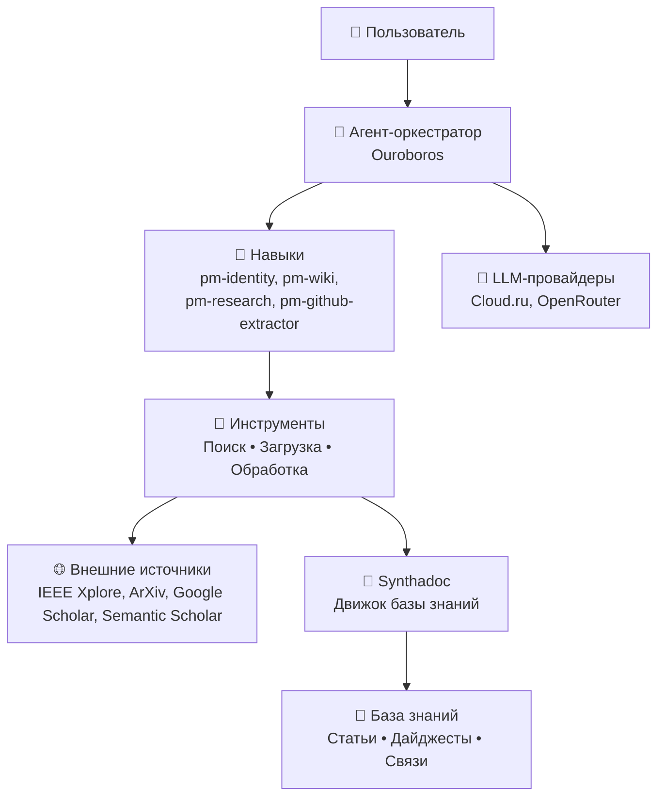

# Knowledge Mining Agent


**Автономный ИИ-агент для управления базой знаний.**

**Knowledge Mining Agent** -  это самосовершенствующийся ИИ-агент со специализацией в Process Mining. Он самостоятельно ищет, анализирует и сохраняет академические статьи, GitHub-репозитории и знания по процессному анализу в структурированную базу знаний (wiki).  
Этот агент переводит управление корпоративной базой знаний из ручного режима в режим постоянного агентного сопровождения. 

---

## 1. 🚀 Быстрый старт

### Шаг 0: Настройте ключ API
Агент поддерживает провайдеров Cloud.ru Foundational Models и OpenRouter. Независимо от выбранного провайдера, ключ указывается в переменной OPENAI_API_KEY:

```bash
export OPENAI_API_KEY="<ключ>"    # Для Windows: set OPENAI_API_KEY="<ключ>"
```

### Шаг 1: Клонируйте репозиторий
```bash
git clone https://github.com/netwise-team/knowledge_mining_agent.git
cd knowledge_mining_agent
```

### Шаг 2: Настройте виртуальное окружение и зависимости
```bash
python -m venv .venv          # Python >= 3.10
source .venv/bin/activate     # Для Windows: .venv\Scripts\activate

python -m pip install --upgrade pip setuptools wheel
python -m pip install -r requirements.txt
python -m pip install -e . --no-deps
```

### Шаг 3: Установите и запустите Synthadoc
```bash
cd synthadoc
pip install -e ".[dev]"
synthadoc --version     # проверка
```

> `-e` важно: без него запускается копия из `site-packages`, и наши правки
> (в т.ч. русский язык) работать не будут. Проверить, откуда грузится код:
> `python -c "import synthadoc; print(synthadoc.__file__)"` — путь должен вести
> в клонированный репозиторий, а не в `site-packages`.

### Шаг 4: Запустите агента и пройдите предварительную настройку агента в UI
```bash
ouroboros server
```
Затем откройте в браузере адрес: http://127.0.0.1:8765.

* Провайдеры и модели
* Безопасность и бюджет
* Сеть и сервер
* Навыки, в т.ч. бот Telegram

### Шаг 5. Запустите bootstrap.py
Скрипт проведет вас через запуск и соединение Synthadoc с моделями, включения MCP-клиента, настройки его на сервер Synthadoc и установки и верификации поставляемых навыков.

---

## 2. 🎯 Основные навыки (Skills)

| Навык | Назначение |
|-------|------------|
| pm-wiki | Интерактивный поиск по базе знаний Process Mining с рейтингованием |
| pm-research | Пакетный поиск и загрузка статей из ArXiv и Semantic Scholar |
| pm-identity | Представление агента и проверка подключения к базе знаний |
| pm-github-knowledge-extractor | Автоматическое извлечение GitHub-репозиториев из статей и создание wiki-страниц в формате Markdown-таблицы |

---
## 3. 🔄 Агентские сценарии. Навыки (Skills)

### 1. Поиск статей. Навык pm-research   
Агент ищет статьи по ключевым словам:  
- "process mining", "process discovery", "conformance checking"  
- "event logs", "audit trail"  
- "process monitoring", "compliance"  
- "process mining banking", "financial auditing"
  
Источники: IEEE Xplore, ArXiv, Google Scholar, Semantic Scholar.   

### 2. Сохранение в pm-wiki. Навык pm-wiki    
- Загружает статьи через synthadoc_ingest  
- Создаёт страницы с заголовком, аннотацией, авторами, годом и ссылкой  
- Проверяет дубликаты перед добавлением  

### 3. Извлечение GitHub-репозиториев. Навык pm-github-knowledge-extractor    
При анализе любой статьи агент автоматически:  
- Сканирует текст на наличие ссылок на GitHub  
- Загружает README через curl  
- Извлекает информацию: архитектуру, алгоритмы, авторов, лицензию, зависимости  
- Создаёт отдельную wiki-страницу с структурой:  
  - Обзор  
  - Архитектура  
  - Ключевые алгоритмы  
  - Установка  
  - Поддерживаемые датасеты
  - Связанные статьи  
  - Лицензия  
- Устанавливает двусторонние связи между статьёй и репозиторием  

### 4. Контроль качества знаний
Работает на двух уровнях:  
- Техническом (структура)
- Смысловом (содержание)
  
Инструмент synthadoc_lint сканирует вики-базу и выявляет:  
- Противоречия
- Наличие неактуальных ссылок и отсутствие ссылок
- Недостоверные знания
  
Инструмент позволяет управлять жизненным циклом знания.  

### 5. Аналитическая работа  

- Отвечает на вопросы пользователя
- Делает краткий пересказ статей с выявлением ключевых аспектов темы
- Составляет тематический дайджест на заданную тему  

---

## 4. ⚙️ Архитектура  

Проект построен на основе трёх ключевых слоёв:

1. Ядро оркестрации (Ouroboros) : Обеспечивает самоизменение, постоянную идентичность агента, многоуровневую безопасность, поддержку множества LLM-провайдеров (OpenRouter, OpenAI, GigaChat, локальные модели) и работу через веб-интерфейс/CLI.

2. Инструменты управления знаниями:
- Synthadoc: Модуль для генерации ответов и синтеза информации из базы знаний.
- LLM Wiki Engine: Набор промптов и логика для построения, проверки противоречий и обновления базы знаний в формате вики-статей.

3. Коннекторы к источникам данных:
Модули для сбора данных из RSS-лент, API сторонних сервисов, веб-скрейпинга и обработки загруженных документов.



---

## 5. 📊 Бенчмарк и оценка качества агента  

Для проверки работы агента подготовлены демонстрационные данные (wikis).  
Описание сценария проверки на функционирование расположено в devtools/benchmarks/pm_wiki/Script.md.

---

## 6. 🤝 Участие в разработке
Мы приветствуем вклад в проект!

Сделайте Fork репозитория.  
Создайте ветку для вашей фичи: git checkout -b feature/new-tool.  
Внесите изменения и закоммитьте их: git commit -m 'Add some feature'.  
Запушьте ветку: git push origin feature/new-tool.  
Откройте Pull Request в ветку main.  
Пожалуйста, убедитесь, что ваш код соответствует стилю проекта (используйте flake8 и black) и покрыт тестами.  

---

## 📝 Changelog

| Version | Changes |
|---------|---------|
| 6.56.4 | Enable all 6 skills (pm-identity, telegram-bridge, pm-github-knowledge-extractor, pm-wiki, pm-research, unix_computer_use). Fix pm-research urllib.parse.quote crash, PDF validation in deduplicate, remove overbroad fs permission. Bump pm-research to 0.2.2. |
| 6.56.3 | Fix skill review blockers: unix_computer_use missing `runtime` field, pm-research path confinement + externalIds crash fix + OPENROUTER_API_KEY env declaration. Bump both skill versions to 0.2.1. |
| 6.56.2 | Prior release. |

---

## 📄 Лицензия
Распространяется под лицензией MIT. Подробности в файле LICENSE.

---

## 🙏 Благодарности

**Knowledge Mining Agent** — превращает хаос информации в упорядоченные и актуальные знания.

---

| Навык | Назначение | Что делает |
|-------|------------|------------|
| **pm-wiki** | Интерактивный поиск по базе знаний Process Mining с рейтингованием | Выполняет семантический поиск по вики-базе знаний, ранжирует результаты по релевантности, возвращает выдержки из статей с указанием источника, авторов и года публикации. Поддерживает уточняющие вопросы и фильтрацию по темам. Позволяет пользователю быстро находить нужную информацию без ручного перебора страниц. |
| **pm-research** | Пакетный поиск и загрузка статей из ArXiv и Semantic Scholar | Принимает поисковый запрос (например, "process mining event logs"), параллельно опрашивает несколько академических источников, загружает полные тексты статей в формате PDF, проверяет их на дубликаты и сохраняет в базу знаний через синтаксический анализ (synthadoc_ingest). Поддерживает ограничение по количеству результатов и глубине поиска. |
| **pm-identity** | Представление агента и проверка подключения к базе знаний | Отвечает на вопросы о самом агенте: его специализации, версии, доступных навыках, текущем состоянии базы знаний (количество статей, репозиториев, дата последнего обновления). Выполняет диагностику подключения к Synthadoc и проверяет целостность вики-страниц. Используется как точка входа для новых пользователей. |
| **pm-github-knowledge-extractor** | Автоматическое извлечение GitHub-репозиториев из статей и создание wiki-страниц в формате Markdown-таблицы | Сканирует текст загруженной статьи на наличие ссылок на GitHub-репозитории, извлекает README через curl, парсит информацию об архитектуре, ключевых алгоритмах, зависимостях, лицензии и авторе. Создаёт отдельную wiki-страницу с детализированной таблицей (обзор, архитектура, алгоритмы, установка, датасеты, связанные статьи) и устанавливает двусторонние связи между статьёй и репозиторием. Автоматически проверяет, не добавлен ли репозиторий ранее. |


